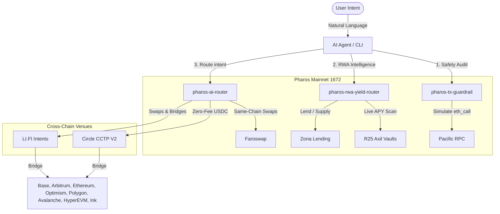

# PHAROS / NEXUS: Agentic Skills Monorepo

**A suite of production-grade, modular AI Agent skills built for the Pharos Network ecosystem.**

This monorepo contains three self-contained skills that any modern agentic environment (such as Claude Code, Cursor, Windsurf, Cline, Continue, Aider, or custom SDKs) can install and call. By installing these skills, the agent gains the ability to execute secure transaction simulations, read and deposit into RWA yield vaults, and route stablecoins and native tokens across major EVM chains.

[](https://pharos.xyz)
[](https://developers.circle.com/cctp/cctp-supported-blockchains)
[-FFB800?style=flat-square)](https://li.quest/v1/chains)
[](https://dorahacks.io/hackathon/pharos-phase1/)
[](LICENSE)

---

## 📦 Skills Directory

| Skill | Folder | Purpose | Primary Capability |
| :--- | :--- | :--- | :--- |
| **Skill 1: Safety Auditing** | [`pharos-tx-guardrail`](./pharos-tx-guardrail) | Pre-execution safety checking. Runs 6 simulation checks to calculate a risk score (0-100). | `PROCEED`, `WARN`, or `BLOCK` recommendations. |
| **Skill 2: Yield Intelligence** | [`pharos-rwa-yield-router`](./pharos-rwa-yield-router) | Live RWA yield scanner and deposit executor for Pacific mainnet vaults. | Query APYs, rank vaults, and auto-execute deposits. |
| **Skill 3: Cross-Chain Routing** | [`pharos-ai-router`](./pharos-ai-router) | Intent-driven bridging and swaps across 9 EVM chains via LI.FI, CCTP, and Faroswap. | Parallel quoting, path ranking, and atomic cross-chain swaps. |

---

## 🛠️ Composition & Architecture

The three skills are designed to work together as a unified execution pipeline:
* The **Yield Router** identifies the best place to allocate capital.
* The **Cross-Chain Router** intent-routes the funds to Pharos (or out to other chains).
* The **Transaction Guardrail** simulates and gates the execution calls to guarantee hot-wallet safety.



---

## ⚡ Setup & Installation

### 1. Simple Universal Prompt Installation
You can let your AI agent install all three skills itself. Paste this prompt into your agent's terminal or chat:

> Install the Pharos Agent Skills from this GitHub repo:
> `https://github.com/hosein-ul/pharos-skills`
>
> Symlink these three skills into your local agent skills folder:
> 1. `pharos-tx-guardrail`
> 2. `pharos-rwa-yield-router`
> 3. `pharos-ai-router`
>
> Read each skill's `SKILL.md` and the root `references/00-bootstrap.md` to self-bootstrap dependencies (Foundry `cast`, Python, curl). Generate a local hot wallet if `AGENT_PRIVATE_KEY` is missing. When you're ready, report your active addresses and capabilities.

### 2. Manual Installation
Clone this monorepo and symlink the folders to where your AI agent reads skills (e.g., Claude Code):

```bash
# Clone the repository
git clone https://github.com/hosein-ul/pharos-skills ~/pharos-skills

# Symlink the three skills into Claude's skill folder
ln -s ~/pharos-skills/pharos-tx-guardrail      ~/.claude/skills/pharos-tx-guardrail
ln -s ~/pharos-skills/pharos-rwa-yield-router  ~/.claude/skills/pharos-rwa-yield-router
ln -s ~/pharos-skills/pharos-ai-router         ~/.claude/skills/pharos-ai-router
```

### Tooling & Bootstrapping
On the first run, the agent will check for required system dependencies:
* **Foundry (`cast`)**: For contract interaction, simulation, and wallet generation.
* **Python**: For parsing JSON quotes, attestation polling, and calculating risk weights.
* **Curl**: For querying live API quotes.

If `AGENT_PRIVATE_KEY` is not found in your environment or in `.env`, the agent will run `cast wallet new` to generate a fresh, secure local hot-wallet and ask you to fund it.

---

## 🛡️ Skill 1: `pharos-tx-guardrail` (Safety Auditing)

Acts as a pre-flight simulator and safety checkpoint. It prevents agents from getting drained, signing malicious payloads, or approving unlimited token allowances.

### Core Audits Run:
1. **Contract Code Verification**: Verifies the target address contains bytecode (`eth_getCode`) to prevent sending funds to empty addresses.
2. **Unlimited Approvals**: Flags transactions calling `approve()` with `MAX_UINT256`.
3. **Dangerous Function Selectors**: Warns on ownership transfers, contract upgrades (`upgradeTo`), or pausing mechanisms.
4. **Simulation Check**: Simulates the transaction using `eth_call` via RPC to verify it does not revert.
5. **Deterministic Risk Score**: Assigns a risk score from `0` to `100` resulting in `PROCEED`, `WARN`, or `BLOCK`.

---

## 📈 Skill 2: `pharos-rwa-yield-router` (Yield Scanner & Executor)

Allows agents to discover, analyze, and deposit into active yield-bearing RWA vaults on the Pharos Pacific mainnet.

### Features:
* **Live Registry Scan**: Reads active vaults (such as R25 Axil consumer credit vaults and Zona real estate lending pools).
* **Risk-Adjusted Ranking**: Factors in protocol risk, asset class, and historical performance to rank opportunities.
* **Yield Execution**: Generates transaction payloads for deposit/withdrawal operations.

---

## 🌉 Skill 3: `pharos-ai-router` (Cross-Chain Routing)

An intent-driven routing system that aggregates **Circle CCTP V2**, **LI.FI**, and **Faroswap** to move stablecoins and native assets seamlessly across chains.

### Supported Corridors

#### Native USDC (Zero Fee, ~8-15 min)
CCTP V2 transfers USDC bidirectionally between Pharos and major chains:
* **Pharos USDC ↔ Ethereum / Base / Arbitrum / Optimism / Polygon / Avalanche**

#### Non-USDC and Multi-Hop routing (LI.FI Polymer & Intents)
Supports swapping and bridging native and wrapped tokens across 70+ chains:

| Pharos ↔ \<Chain\> | Supported Counter-Tokens (Bidirectional) | Bridge Mechanism |
| :--- | :--- | :--- |
| **Base** ⭐ | USDT, USD0, USDC, ETH, PROS | **LI.FI Intents** (Atomic, ~13 sec) |
| **Arbitrum** | USD0, USDC, ETH, PROS | LI.FI Polymer / Intents |
| **Ethereum** | USDC, WETH, ETH, PROS | LI.FI Polymer / Intents |
| **Polygon** | USDC, USDT, ETH, POL, PROS | LI.FI Polymer / Intents |
| **Optimism** | USDC, USDT0, ETH, PROS | LI.FI Polymer / Intents |
| **HyperEVM** | USDT0, USDC, HYPE | LI.FI Polymer / Intents |
| **Ink** | USDT0, USDC, WETH | LI.FI Polymer / Intents |

---

## 📄 Quick Reference Code Snippets

### 1. Perform a Pre-Flight Safety Simulation Check
```bash
# Check if target contract has code and simulate call
TARGET_ADDRESS="0xc879c018db60520f4355c26ed1a6d572cdac1815"
cast code $TARGET_ADDRESS --rpc-url https://rpc.pharos.xyz
```

### 2. Live Quote & Route Selection (CCTP vs. LI.FI)
Run the script to fetch and rank live cross-chain routes:
```bash
# Format: rank-routes.sh <sourceChain> <destChain> <fromToken> <toToken> <amount>
bash pharos-ai-router/scripts/rank-routes.sh pharos base USDC USDC 10
```

### 3. Direct Circle CCTP Bridge (Pharos → Base)
```bash
# Approve Messenger V2 to burn USDC
cast send 0xc879c018db60520f4355c26ed1a6d572cdac1815 "approve(address,uint256)" 0x28b5a0e9C621a5BadaA536219b3a228C8168cf5d 1000000 --rpc-url https://rpc.pharos.xyz --private-key $AGENT_PRIVATE_KEY

# Deposit For Burn (Domain 6 = Base)
cast send 0x28b5a0e9C621a5BadaA536219b3a228C8168cf5d "depositForBurn(uint256,uint32,bytes32,address,bytes32,uint256,uint32)" 1000000 6 "0x000000000000000000000000SENDER_ADDRESS" 0xc879c018db60520f4355c26ed1a6d572cdac1815 "0x000" 0 2000 --rpc-url https://rpc.pharos.xyz --private-key $AGENT_PRIVATE_KEY
```

---

## 🔒 Verified Contract Addresses (Pacific Mainnet)

### Circle CCTP V2 (Uniform across all major EVM chains)
* **TokenMessengerV2**: `0x28b5a0e9C621a5BadaA536219b3a228C8168cf5d`
* **MessageTransmitterV2**: `0x81D40F21F12A8F0E3252Bccb954D722d4c464B64`

### Stablecoins & Native Tokens
* **Pharos Native Token (PROS)**: `0x0000000000000000000000000000000000000000` (Chain ID: 1672)
* **USDC (FiatTokenProxy)**: `0xc879c018db60520f4355c26ed1a6d572cdac1815`
* **LI.FI Diamond Proxy**: `0xFf70F4A1d11995621854F3692acF286d8aCd04b2`
* **Faroswap Router**: `0xA5cA5Fbe34e444F366B373170541ec6902b0F75c`

---

## 🌐 Networks & RPC Endpoints

| Network | Chain ID | RPC URL | Native Currency | Explorer |
| :--- | :--- | :--- | :--- | :--- |
| **Pharos Pacific Mainnet** | `1672` | `https://rpc.pharos.xyz` | `PROS` | [Explorer](https://pharosscan.xyz) |
| **Pharos Atlantic Testnet** | `688689` | `https://atlantic.dplabs-internal.com` | `PHRS` | [Explorer](https://atlantic.pharosscan.xyz) |

---

## ⚖️ License & Version

* **Version**: `0.3.0` (Supports LI.FI-first route ranking, CCTP V2 fallback, and safety pipeline gating)
* **License**: MIT
